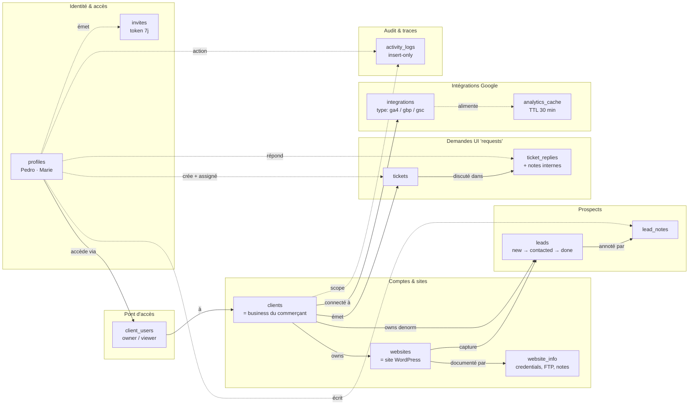
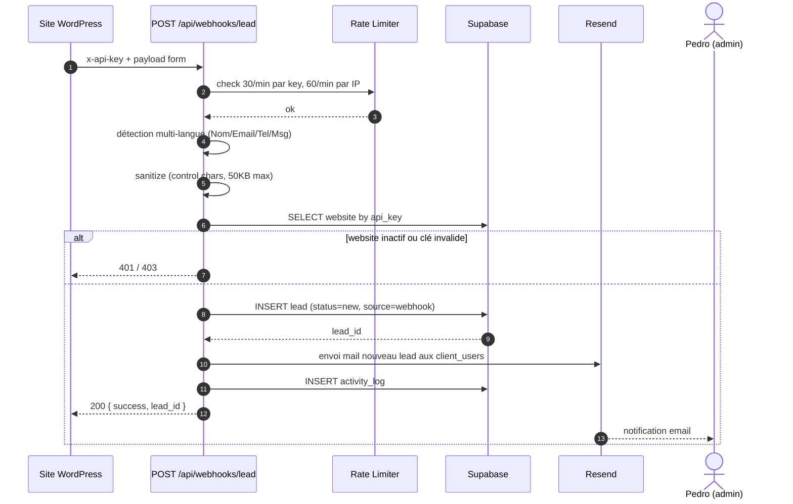
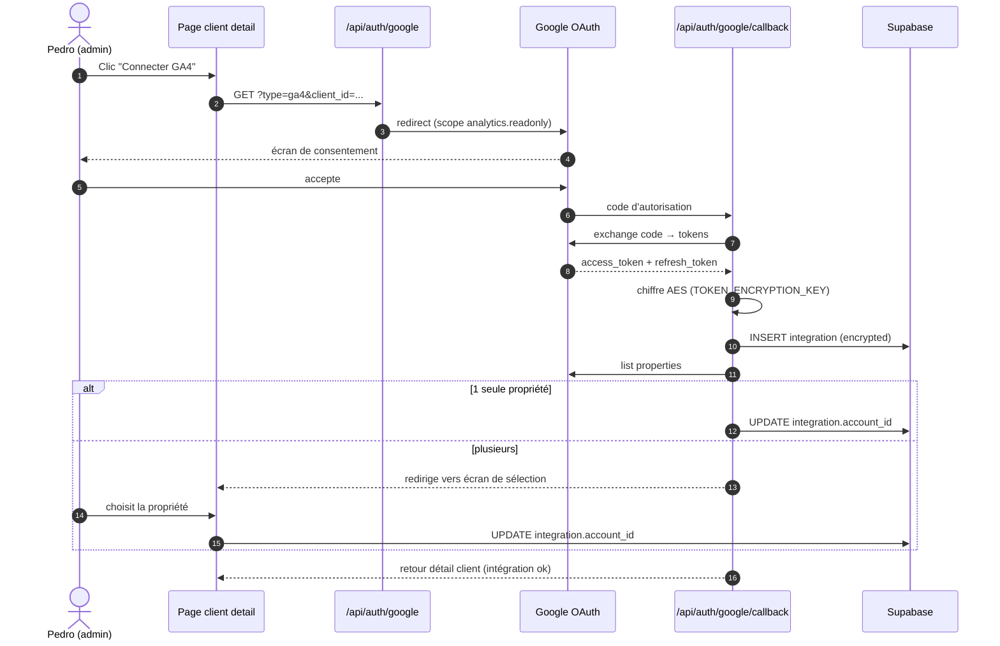
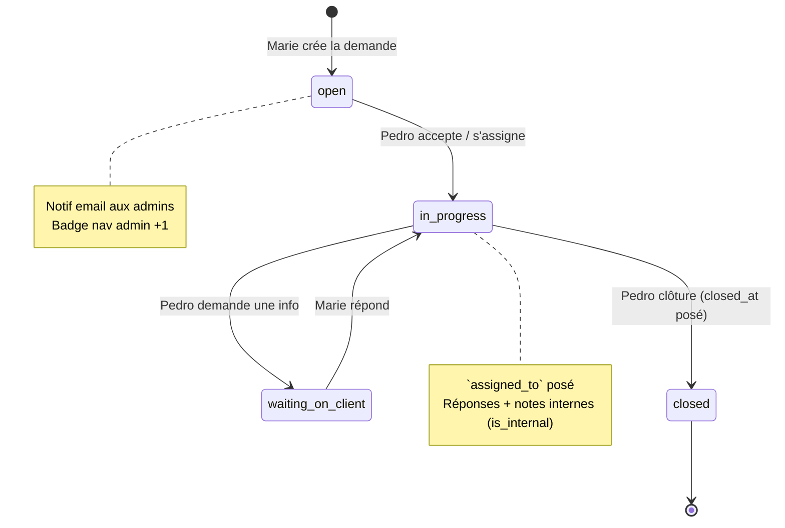

# Domain Model — VSP Client Dashboard

> **But** : faire comprendre en un coup d'œil comment s'articulent les entités et les flux métier de l'app, pour qu'un dev qui débarque sache où chercher.
>
> Source de vérité : `types/database.ts` (types) et `supabase/migrations/` (schémas). Ce doc explique _ce que ça veut dire_, pas _comment c'est typé_.
> Voir aussi : `docs/UX-glossaire.md` (vocabulaire UI ↔ DB), `docs/UX-parcours.md` (parcours user), `docs/Backlog.md` (état des features).

---

## Personae (rappel)

| Rôle DB     | Persona                                 | Ce qu'il fait                                                     |
| ----------- | --------------------------------------- | ----------------------------------------------------------------- |
| `admin`     | **Pedro** — agence VSP                  | Gère tous les clients, sites, leads, intégrations. Accès complet. |
| `client`    | **Marie Dubois** — restaurant Le Jardin | Voit _ses_ prospects et stats. Émet des demandes. Mobile-first.   |
| _(externe)_ | **Sites WordPress**                     | Envoient les leads via webhook. Pas d'identité dans la DB.        |

Pedro = client final de la mission ET utilisateur du rôle Admin du SaaS.
Mathias / Ugo / Jessie / Antoine = prestataire Orange Bleu (ne sont pas des personae du produit).

---

## Vue d'ensemble — clusters métier

Lecture rapide : six îlots de domaine reliés par `clients` et `profiles`.

**Ce qu'il faut retenir** :

- `clients` est le **hub** : tout ce qui a une valeur métier (sites, leads, intégrations, demandes, alertes) appartient à un client.
- `profiles` est le **second hub** : tout acte (création, note, réponse, log) est attribué à une personne.
- `client_users` est la **table de jonction** N–N entre humains et businesses. Pedro n'y figure _pas_ (il est admin, vue globale) — seuls les `client`-role users y sont rattachés.
- `client_id` est **dénormalisé** sur `leads` (et `lead_notes` via `leads`) pour éviter le 3-joints lors des listes (cf. `getLeadsPaginated`).

---

## Lecture par cluster

### 1. Identité & accès — `profiles`, `client_users`, `invites`

- **`profiles`** est en relation 1:1 avec `auth.users` (Supabase Auth). On ne touche jamais `auth.users` directement depuis l'app.
- **`role`** sur `profiles` est la première frontière de sécurité : `admin` voit tout (RLS `is_admin()`), `client` voit uniquement les rangs reliés via `client_users`.
- **`client_users`** est la table de jonction qui matérialise _"cet utilisateur a accès à ces businesses"_. Un même `client` row peut être partagé entre plusieurs utilisateurs (rôles `owner` ou `viewer`).
- **`invites`** porte l'onboarding : un admin crée un invite, un email part avec un token, l'invité atterrit sur `/invite/[token]` et son `profile` + `client_users` sont créés à l'acceptation. `client_ids` est un array — un invite peut donner accès à plusieurs businesses d'un coup.

> **Piège classique** : un `profile.role = 'admin'` n'a _pas_ de ligne dans `client_users`. La RLS le débloque via la fonction `is_admin()`. Ne pas confondre absence de ligne avec absence d'accès.

### 2. Comptes & sites — `clients`, `websites`, `website_info`

- **`clients`** ≠ utilisateur. Un `client` = un business (Marie = restaurant Le Jardin). Les humains qui y accèdent sont rattachés via `client_users`.
- **`websites`** est l'unité de capture des leads. Chaque site a une `api_key` (UUID) + un `webhook_secret` (32 bytes) — c'est l'auth des webhooks entrants.
- **`website_info`** stocke des paires `label/value` typées (FTP creds, WP admin, etc.). Le flag `is_sensitive` masque la valeur dans la UI admin (révélée au clic).
- **`is_active`** sur `websites` coupe le webhook : un site inactif rejette les POST `/api/webhooks/lead`.

### 3. Prospects — `leads`, `lead_notes`

- **`leads`** porte deux FK : `website_id` (site source) et `client_id` (dénormalisé pour les listes paginées).
- **`source`** distingue `webhook` (entrée auto), `manual` (créé par admin), `api` (créé via API tierce). Champ d'**audit système** : trace _comment la ligne DB a été créée_. À ne pas confondre avec le **connecteur** (système externe d'origine) — colonne `leads.connector` distincte (slug : `wordpress-form`, `generic-webhook`, …), livrée en E4. Cf. `docs/Connecteurs.md`.
- **`status`** suit le cycle `new → contacted → done`. **Statut "devenu client"** prévu en **Epic E5** (extension de l'enum).
- **`raw_data`** garde le payload brut du formulaire (toujours utile pour le debug multi-langue : Elementor, CF7, WPForms). Depuis E4, ce payload est consommé par un connecteur dédié (`lib/leads/connectors/`) plutôt que par un parser monolithique inline.
- **`lead_notes`** est strictement append-only via l'UI (pas d'édition, pas de suppression depuis le front).

> **Pas une feature** : aucune notion de « origine marketing » (UTM Google Ads / Facebook Ads) n'est planifiée. Cette couche analytics est distincte des connecteurs et n'est pas demandée par les maquettes.

### 4. Demandes — `tickets`, `ticket_replies`

> ⚠️ La table s'appelle `tickets` mais l'UI dit **"demandes" / "requests"**. Décision UX assumée — cf. `UX-glossaire.md` § "demandes vs prospects".

- **`tickets.created_by`** est toujours un humain (Marie ou Pedro). **`assigned_to`** est le membre d'équipe responsable côté admin.
- **`category`** distingue `bug / feature_request / support / billing` — utile pour le tri admin.
- **`ticket_replies.is_internal = true`** = note privée admin, invisible côté client (vérifié dans la query côté serveur, pas que côté UI).
- Le **chat widget support** (bulle flottante mobile) est un cas particulier : il réutilise `tickets` via `getOrCreateChatTicket()` — un seul ticket "chat" par client, abondé de replies.

### 5. Intégrations Google — `integrations`, `analytics_cache`

- **`integrations`** stocke un compte OAuth par (`client_id`, `type`). Trois types : `ga4`, `gbp`, `gsc`. Pas de Facebook (retiré en E1).
- **Tokens chiffrés AES** (`TOKEN_ENCRYPTION_KEY`). Le refresh est automatique dans `lib/google.ts` si `token_expires_at` est proche.
- **`account_id`** = ID de la propriété GA4 / location GBP / site GSC. Sélection au premier connect (auto si une seule dispo).
- **`analytics_cache`** : TTL effectif de 30 min. Clé composite (`client_id`, `integration_type`, `metric_type`, `period_*`). Bouton "force refresh" dans la UI bypasse le cache. Cleanup via cron `/api/cron/cleanup-cache`.

### 6. Audit & traces — `activity_logs`

- **Insert-only par RLS** : aucune route ne peut modifier ou supprimer un log. Garantit l'intégrité de l'audit.
- Toutes les actions admin notables passent par `activity.ts::logActivity()`. Ce sont elles qui alimentent l'historique du détail client et l'activité globale du dashboard admin.
- `client_id` et `user_id` sont nullables (ex. action système sans cible précise).

---

## Flux métier clés

### Flux A — Réception d'un lead (du site WordPress à la notif)

**Points d'attention** :

- La détection multi-langue vit dans le connecteur `generic-webhook` (`lib/leads/connectors/`), plus dans `route.ts` (refacto E4).
- Les rate-limits sont **en-mémoire** (`lib/rate-limit.ts`) — survivent au lifecycle Vercel mais pas au cold start. Acceptable pour le scope MVP.
- Pas de push, pas de Facebook (retirés en E1). Email Resend uniquement.

### Flux B — Connexion d'une intégration Google (OAuth)

**Points d'attention** :

- Le `state` OAuth porte `client_id` + `type` pour retrouver le contexte au callback.
- Refresh des tokens : `lib/google.ts` le fait à la demande quand `token_expires_at - 5min < now`.
- Si refresh échoue : `is_active = false` + alerte client (F14.3 — "intégrations cassées").

### Flux C — Cycle de vie d'une demande

**Points d'attention** :

- `closed_at` est posé uniquement quand `status = closed` (utile pour les métriques de temps de résolution).
- Les réponses `is_internal = true` ne remontent jamais côté Marie — filtrage côté serveur dans `getTicket()`.
- Le chat widget mobile (`support-chat.tsx`) bypasse partiellement ce cycle : un seul ticket "chat" par client, jamais clôturé.

---

## Enums & statuts — référence

| Enum              | Valeurs                                                    | Où c'est utilisé                                                                                                      |
| ----------------- | ---------------------------------------------------------- | --------------------------------------------------------------------------------------------------------------------- |
| `UserRole`        | `admin` \| `client`                                        | `profiles.role`, RLS, `requireAdmin()`                                                                                |
| `AccessRole`      | `owner` \| `viewer`                                        | `client_users.access_role`                                                                                            |
| `LeadSource`      | `webhook` \| `manual` \| `api`                             | `leads.source` — audit système (comment la ligne DB a été créée)                                                      |
| `LeadConnector`   | slug texte (registry TS)                                   | `leads.connector` — système d'input externe d'origine (`wordpress-form`, `generic-webhook`, …). Cf. `Connecteurs.md`. |
| `LeadStatus`      | `new` \| `contacted` \| `done`                             | `leads.status` — pipeline CRM (E5 ajoutera `client_won`)                                                              |
| `IntegrationType` | `ga4` \| `gbp` \| `gsc`                                    | `integrations.type`, `analytics_cache.integration_type`                                                               |
| `TicketStatus`    | `open` \| `in_progress` \| `waiting_on_client` \| `closed` | `tickets.status`                                                                                                      |
| `TicketPriority`  | `low` \| `medium` \| `high` \| `urgent`                    | `tickets.priority`                                                                                                    |
| `TicketCategory`  | `bug` \| `feature_request` \| `support` \| `billing`       | `tickets.category`                                                                                                    |
| `AppLanguage`     | `en` \| `fr-BE` \| `ro`                                    | `profiles.language`, `lib/i18n/translations.ts`                                                                       |

---

## Modules retirés en E1 (ne pas re-coder par accident)

Cf. `Backlog.md` § F20. Ces tables ont été **droppées** (migration 024), donc absentes du modèle ci-dessus :

| Module                                  | Table associée             |
| --------------------------------------- | -------------------------- |
| Reports PDF mensuels                    | `reports`                  |
| Push notifications                      | `push_subscriptions`       |
| Admin Tools (broken-links, SEO, uptime) | `site_checks`              |
| WordPress AI                            | `wordpress_*`              |
| Change detection                        | `website_change_detection` |

Si tu vois encore une référence à ces tables dans le code, c'est de la dette à nettoyer (signale-le).

---

## Pour aller plus loin

| Quoi                      | Où                                            |
| ------------------------- | --------------------------------------------- |
| Types TS canoniques       | `types/database.ts`                           |
| Schémas SQL               | `supabase/migrations/001..027`                |
| Server actions par entité | `lib/actions/{clients,websites,leads,...}.ts` |
| Glossaire UI ↔ DB         | `docs/UX-glossaire.md`                        |
| Parcours utilisateur      | `docs/UX-parcours.md`                         |
| État des features         | `docs/Backlog.md`                             |
| Cadrage produit           | `docs/Mission.md`                             |
| Avancement / décisions    | `docs/Suivi.md`                               |
